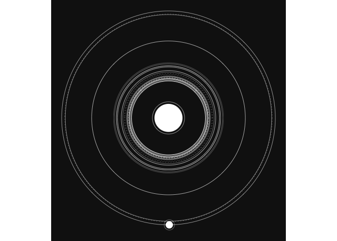
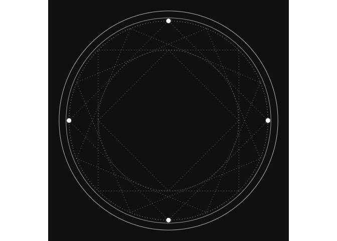
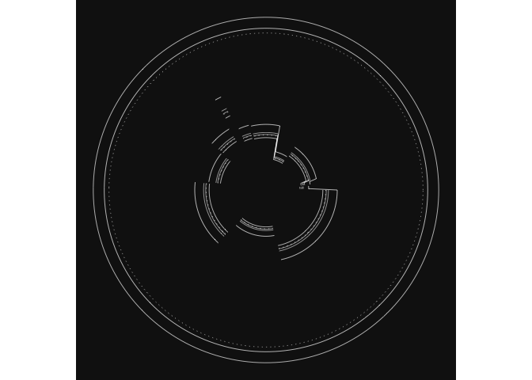

# glyph

`glyph` is a package for making generative art. It contains functions to
produce various styles of “glyphs”, as described in these
<a href="" target="_blank">blog</a>
<a href="" target="_blank">posts</a>. To understand better, see the
examples or [instructions](instructions/glyph_instructions.md). The
package can be used by calling the main functions (`orbit()`,
`summon()`, `orbit_glitch()`), or by using the Rstudio addin to launch a
graphical user interface where you can adjust parameters, generate
glyphs, and download the images.

## Installation

`glyph` only lives on GitHub, you can install it with:

``` r
# install.packages("devtools")
devtools::install_github("will-r-chase/glyph")
```

## Example

Here I will show three basic examples of producing glyphs by code. See
the [instructions](instructions/glyph_instructions.md) for further
explanation, and give the GUI addin a try.

``` r
library(glyph)
#> Warning: replacing previous import 'shiny::runExample' by
#> 'shinyjs::runExample' when loading 'glyph'

#First, make a basic orbital glyph
orbit(seed_probs = c(0.3, 0.5, 0.1, 0.1), planet_probs = c(0.4, 0.3, 0.2, 0.2), pareto2_prob = c(0.3, 0.7))
```



``` r

#Next try making a 'summoning circle' glyph
summon()
```



``` r

#Finally, how about glitched glyph
orbit_glitch(glitch_type = "shattered")
```



``` r

#you can save plots with ggsave()
```
